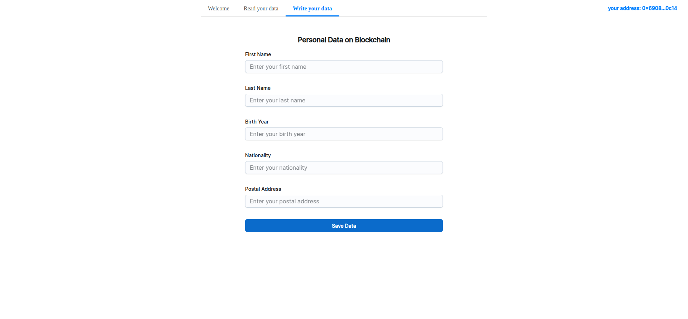

# Personal Data Storage dApp

This project allows users to securely store and manage their personal data on the blockchain. It provides a simple web interface to save, update, and view personal information such as name, birth year, nationality, and postal address, directly on the blockchain.

## Features

- **Save Personal Data**: Users can save their personal information to the blockchain, ensuring privacy and security.
- **Update Personal Data**: Users can update their personal data, ensuring that it remains accurate and up-to-date.
- **View Personal Data**: Users can retrieve and view their saved data from the blockchain.

## Tech Stack

- **Frontend**: React.js, Joy-UI, Vite
- **Blockchain**: Ethereum, Solidity, ethers.js
- **Smart Contract**: Written in Solidity to handle storing and retrieving personal data on Ethereum.

### Prerequisites

- Node.js (v23.0 or later)
- npm (v10.9 or later)
- MetaMask or another Web3 wallet
- Ethereum network (Testnet or Mainnet)
- Vite for development server

## Screens

